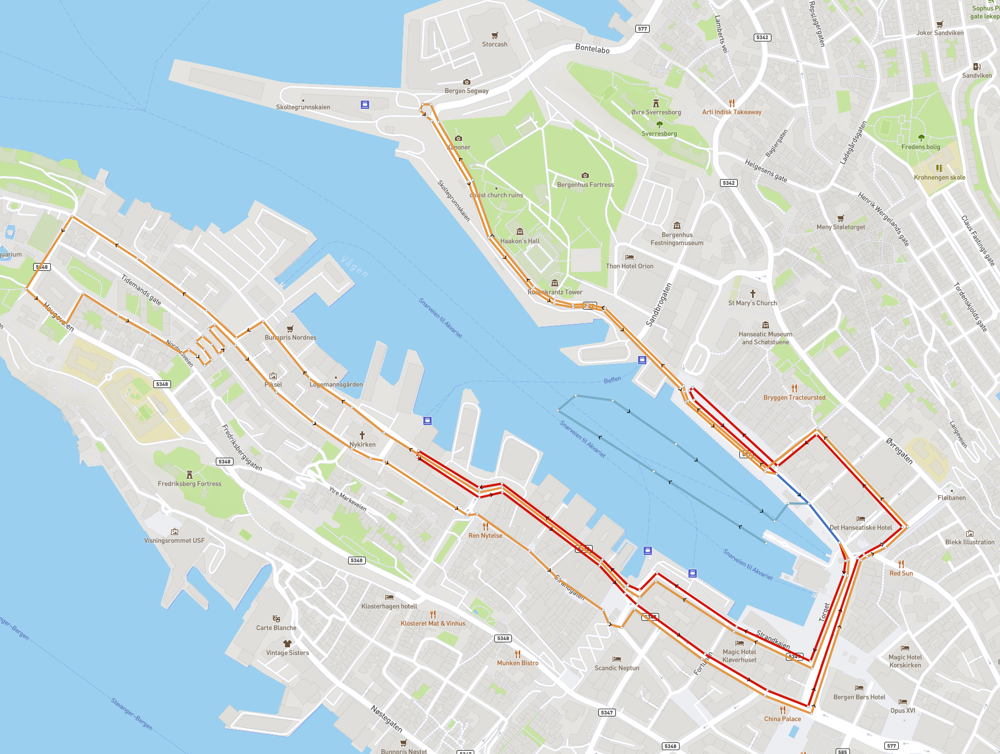

# Bergen-Triathlon-Map
Proof of concept interactive Bergen Triathlon Map

Created using mapbox-gl-js to render the map.

Used JOSM to draw the course as a GeoJSON file.

Original map from https://www.bergentriathlon.no/news/triathlon%20verdenscup%20l%C3%B8ype%20bergen/

Example of rendered map:

## Future plans:

- [x] 3d kart med høydefunksjon
- [ ] Video av nedstigningen av svingene på Nordnes
- [ ] Elevation profile across the course
- [ ] Geotaggede bilder droppet inn i kartet
- [ ] Dronevideo fra fjellet
